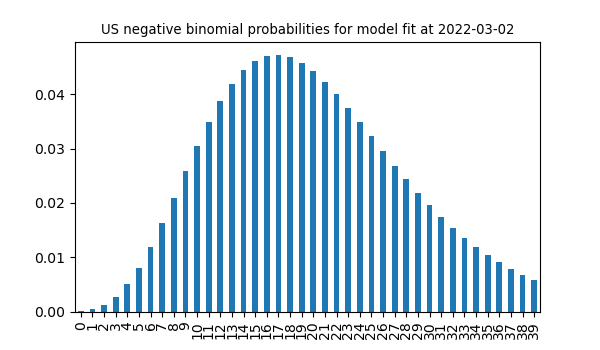

# COVID19 negative binomial model
Negative binomial model for projecting COVID-19 cases and deaths data by country, provided by Johns Hopkins University CSSE at [CSSEGISandData/COVID-19](https://github.com/CSSEGISandData/COVID-19).

For a description and the evolution of the model, see in [docs](docs/)  `20200429 Squashing the sombrero - negative binomial model for COVID-19 deaths.pdf` and the addition of time-varying survival rates as documented in `20200512 COVID-19 deaths projection now uses time-varying survival rate.pdf`. 
In order to address weekday patterns for deaths and cases, changes were made as detailed in `20200519 weekday seasonality added to COVID-19 deaths projection.pdf`, `20200615 allowing for new cases seasonality in the COVID-19 deaths projection.pdf` and `20200630 allowance for improvement in survival rates in COVID-19 deaths projection.pdf`   

The function `main()` fits the model to the latest date and charts the results. These charts are saved daily in the [latest](latest/) and archived to the [archive](archive/) directory. 

## Published daily new cases and deaths
For example, the new cases and deaths experience to date for the USA is:

## Time-varying survival rates
The model fits a time-varying survival rate and a negative binomial model for days until death given a new case does not survive:

## Projected new cases and deaths
The fitted projection for the model is then: 

## Weekday reporting patterns
This projection shows a characteristic weekday reporting pattern:

## Trends in new cases growth rates
The new cases growth rate is critical. The chart below compares the evolution of this rate across countries and against the R0=1 reproduction rate boundary:

The generous 1MB limit on a github repo accommodates about a year of historical charts.
